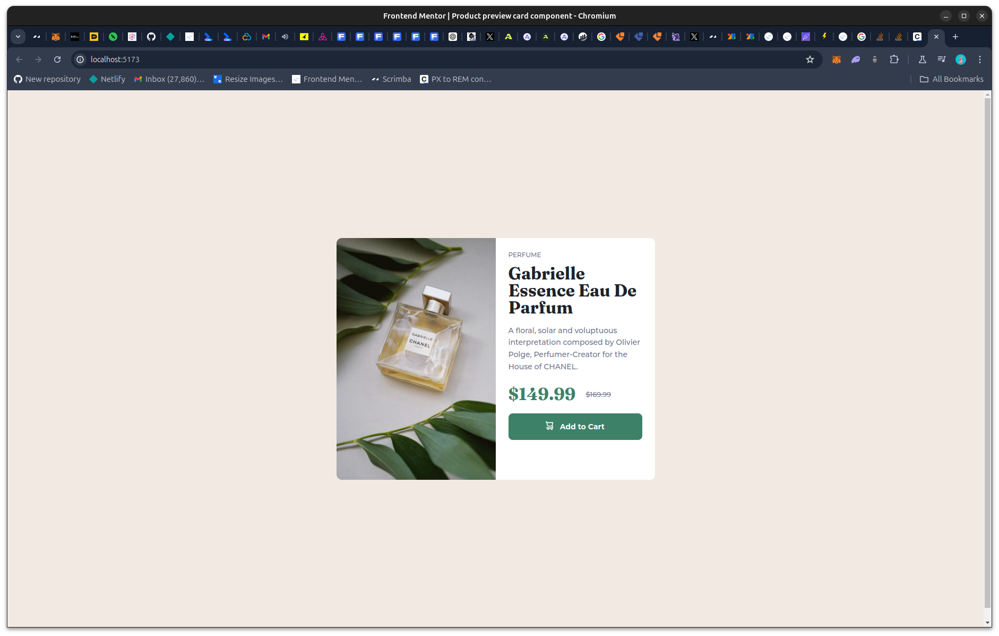

# Frontend Mentor - Product preview card component solution

This is a solution to the [Product preview card component challenge on Frontend Mentor](https://www.frontendmentor.io/challenges/product-preview-card-component-GO7UmttRfa). Frontend Mentor challenges help you improve your coding skills by building realistic projects.

## Table of contents

- [Overview](#overview)
  - [The challenge](#the-challenge)
  - [Screenshot](#screenshot)
  - [Links](#links)
- [My process](#my-process)
  - [Built with](#built-with)
  - [What I learned](#what-i-learned)
  - [Continued development](#continued-development)
  - [Useful resources](#useful-resources)
- [Author](#author)

## Overview

### The challenge

Users should be able to:

- View the optimal layout depending on their device's screen size
- See hover and focus states for interactive elements

### Screenshot



### Links

- Solution URL: [Live Site](https://product-preview-achigyus.netlify.app/)
- Live Site URL: [Github Repo](https://github.com/Achigyus/product-preview-card-component)

## My process

### Built with

- Semantic HTML5 markup
- CSS custom properties
- Flexbox
- Mobile-first workflow
- [React](https://reactjs.org/) - JS library

### What I learned

I learned a lot about responsive design while doing this challenge and was able to implement code that is more responsive through the use of css properties such as `inline-size`, `block-size`, and `margin-block-end`. Here are some examples of their usage:


```css
.product_preview_type {
  color: #6c7289;
  font-size: 0.75rem;
  line-height: 1.25;
  margin-block-end: 0.75rem;
  text-transform: uppercase;
}

.product_preview_img_container,
.product_preview_details {
  inline-size: 50%;
}

.product_preview_img_desktop {
  display: inline-block;
  border-radius: 0.625rem 0 0 0.625rem;
  block-size: 100%;
}
```

### Continued development

I will continue to learn and implement more responsive and accesible designs in my websites

### Useful resources

- [Web(.)dev Course on responsive Design](https://web.dev/learn/design/welcome?continue=https%3A%2F%2Fweb.dev%2Flearn%2Fdesign%23article-https%3A%2F%2Fweb.dev%2Flearn%2Fdesign%2Fwelcome) - This helped me to understand how important it is to use responsive design.

## Author

- Website - [Achigyus](https://github.com/Achigyus)
- Frontend Mentor - [@Achigyus](https://www.frontendmentor.io/profile/Achigyus)
- Twitter - [@ElUchihaAnbu](https://www.twitter.com/ElUchihaAnbu)
